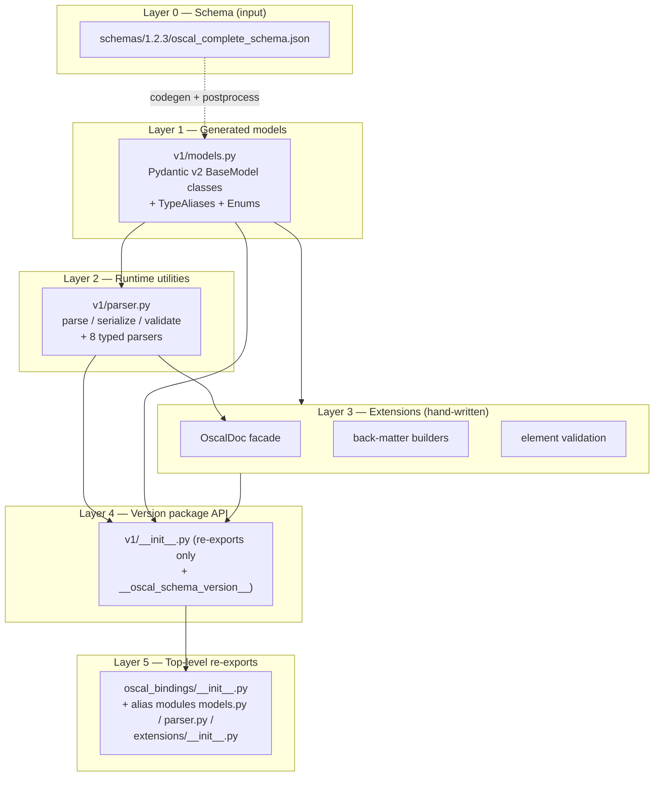
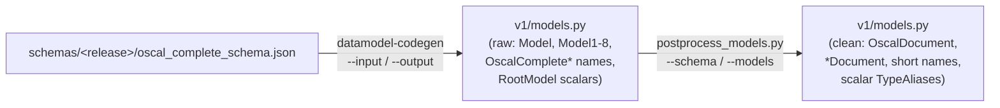

# Architecture

## System Purpose

`oscal-bindings` is a **data-binding library**, not a service or application. It targets OSCAL release 1.2.3. Its job is to turn OSCAL JSON documents into type-safe Python objects and back again, with convenience layers that make common tasks (uniform field access, building `back-matter` resources, validating fragments) ergonomic.

There is no network server, no persistence layer, and no long-running process. The architecture is best understood as **two pipelines**: a *build-time code-generation pipeline* that produces the models, and a *runtime consumption pipeline* that downstream code uses.

## Layered Architecture

Each layer depends only on layers below it. Extensions depend on `v1/models.py` (and `v1/parser.py` for `OscalDoc.from_json/from_file`), never the reverse. Layers 4 and 5 are both pure re-export: layer 4 is the API of record, layer 5 exists only to keep the pre-`v1` flat import paths resolving.

## Version Namespacing

The binding namespace is scoped to the OSCAL **major** version, not the minor. OSCAL 1.x is backward-compatible within its major version, and NIST's own schema `$id` reflects that split — `http://csrc.nist.gov/ns/oscal/1.0/1.2.3/oscal-complete-schema.json` carries `1.0` as the *namespace* and `1.2.3` as the *release*. A namespace per minor release (`v1_2`, `v1_3`) would encode a break that does not exist and force consumer import churn on every routine refresh.

Consequences of that choice, as implemented:

- A minor or patch schema refresh regenerates `oscal_bindings.v1` **in place**. Import paths do not move.
- `__oscal_schema_version__` on `oscal_bindings.v1` records the exact release, since the package name deliberately carries only the major version.
- Because models are `extra='forbid'`, "covers OSCAL 1.x" is contingent on tracking the current release — a document using a field added after 1.2.3 is rejected, not ignored. `__oscal_schema_version__` is the introspection mechanism for reasoning about that.
- OSCAL 2.0 is the trigger for a second version package. Until then there is deliberately no `v2`, no dispatch registry, and no shared abstraction layer between version packages.

## Design Patterns

### Facade — `OscalDoc`
Every OSCAL top-level document carries `metadata` and a body-level `uuid`, but the path to them differs per type (`doc.catalog.metadata` vs `doc.system_security_plan.metadata`). `OscalDoc` collapses that dispatch behind uniform properties. A class-level dict `_WRAPPER_TO_BODY_ATTR` maps each of the 8 wrapper types to its body attribute name, so `body` is a single `getattr` rather than an 8-way `if`/`elif` chain.

### Adapter / Convenience constructors — builders
`make_hash`, `make_rlink`, `make_resource` adapt the raw Pydantic models (which use camelCase JSON aliases, forbid extras, and don't populate-by-name) into kwarg-friendly Python constructors with sensible defaults (e.g. auto UUID4).

### Generated-code + post-processor
Rather than hand-maintaining ~7000 lines of models, the library generates them and applies a deterministic rename pass. This keeps the models faithful to the schema while giving them clean names. The generator output is never hand-edited — regeneration is idempotent.

### Re-export facade for the package
`v1/__init__.py` and `v1/extensions/__init__.py` contain only imports and `__all__`. This makes the entire public surface auditable in one file and decouples callers from internal module layout.

### Top-level re-exports with explicit alias modules
The top-level `oscal_bindings/__init__.py` re-exports from `oscal_bindings.v1` and derives its `__all__` from `v1.__all__` rather than restating it, so the two surfaces cannot drift. It star-imports `oscal_bindings.v1.models` *directly* (not via `v1`) because `v1.__all__` would otherwise bound the star-import to the curated surface and drop the ~180 generated model names that line exists to carry.

The top-level submodule paths get real files — `oscal_bindings/models.py`, `oscal_bindings/parser.py`, `oscal_bindings/extensions/__init__.py` — each re-exporting from its `v1` counterpart. Explicit alias modules rather than `sys.modules` aliasing: they are greppable and survive `mypy` and `pdoc` without special cases. Because everything is a re-export rather than a wrapper, a class reached through the top level **is** the same object as the one reached through `v1`, so `isinstance` agrees across paths.

## Code-Generation Architecture

Both the schema path and the models path are passed explicitly, and each `--` argument carries its own independent default, so a bare invocation works and supplying exactly one argument works too. The Active_Schema_Bundle is selected **by the passed path alone** — no directory scan, no glob, no "newest release wins" — so adding a schema bundle directory changes nothing until the passed path changes.

The post-processor performs, in order:
1. **Collapse scalar RootModels** into `TypeAlias`es (except unions and `PRESERVE_AS_ROOTMODEL = {Model, Mappings}`).
2. **Fix constraints** invalid on non-string types (strip `pattern=` from `AwareDatetime`, `AnyUrl`, numeric, `EmailStr` fields).
3. **Derive and apply the document rename map** — see below — and rename the root `Model` → `OscalDocument`.
4. **Rename variants** (`...Merge1/2/3` → `MergeFlat/MergeAsIs/MergeCustom`, catalog group variants).
5. **Strip the `OscalComplete...` namespace prefix** from remaining class names, using the schema definitions to compute short names and applying `COLLISION_OVERRIDES` for the names that collide across document types.
6. **Guard against collisions** — scan the fully renamed source for duplicate `class <Name>(` definitions and refuse to write if any remain.

### Content-based wrapper naming

Document wrapper names are derived from the generated source's own **content**, never from the ordinal suffix `datamodel-codegen` assigns. A wrapper is identified by the `$schema` directive field it carries; its root key is the single remaining body field; the published name is that key in PascalCase plus a `Document` suffix (`catalog` → `CatalogDocument`, `system_security_plan` → `SystemSecurityPlanDocument`). A class carrying only the `$schema` field is the union root, not a wrapper.

A positional map (`Model1` → `CatalogDocument`, …) would silently produce wrong names if a schema revision reordered or added document types. Three guards back the derivation:

| Guard | Behavior |
|-------|----------|
| Ambiguous wrapper (>1 body field besides `$schema`) | **Fail fast** — report the *first* offender and exit non-zero, leaving the rest unscanned; the derivation's premise is already void |
| Derived wrapper count ≠ document types in the schema's top-level `oneOf` | Exit non-zero reporting both counts (skipped only if the schema has no top-level `oneOf`) |
| Duplicate class definitions after all renames | **Accumulate** — finish the scan, then exit non-zero reporting *every* uncovered collision in one report, rather than writing a file with duplicate definitions |

The asymmetry is deliberate: ambiguity invalidates the scan's own assumption, so continuing is meaningless, whereas collisions are independent findings and a maintainer wants the complete list in one run rather than discovering them one regeneration at a time.

## Key Architectural Decisions

| Decision | Rationale |
|----------|-----------|
| Generate models, don't hand-write | Faithful to NIST schema; regenerable when OSCAL updates |
| Keep generated code pristine; helpers in `extensions/` | Codegen pipeline stays a clean run + rename pass; helpers evolve independently |
| Collapse scalar RootModels to TypeAliases | Callers access `catalog.metadata.version` directly, no `.root` unwrapping |
| Module-prefixed names for 5 collisions | Disambiguate e.g. `SspControlImplementation` vs `ComponentDefinitionControlImplementation` |
| Major-version namespace (`oscal_bindings.v1`) | The compatibility boundary is the major version, matching NIST's `$id` split; minor-version namespacing rejected as it would force import churn on every routine refresh — see `DEVELOPING.md` Key Design Decisions |
| Top level as a pure re-export of `v1` | Short import paths for callers who don't need to name the major version; both paths resolve to the identical objects |
| Release-versioned schema bundles (`schemas/<release>/`) | The schema a binding set came from is unambiguous, and a refresh is a visible, reviewable change |
| Wrapper names derived from content, not ordinals | A schema revision that reorders or adds document types cannot silently mis-name classes |
| `__oscal_schema_version__` constant, written as a literal | The package name carries only the major version; a literal avoids parsing a multi-megabyte schema at import time (and the bundle is not guaranteed to ship in the wheel). A test asserts it against the real `$id` |
| `bytes`-accepting parsers | Skip a UTF-8 decode + one document-size allocation for byte-sources (HTTP/S3/file) |

See `dependencies.md` for the external toolchain and `workflows.md` for the end-to-end generation and consumption flows.
