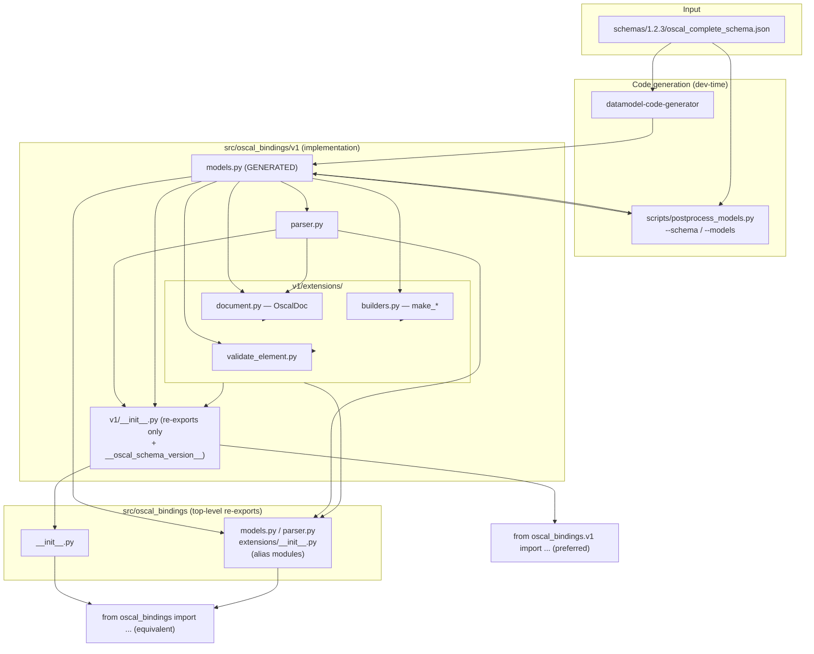

# Codebase Information

## Overview

`oscal-bindings` provides typed Python data bindings for [OSCAL](https://pages.nist.gov/OSCAL/) (Open Security Controls Assessment Language) release 1.2.3. The Pydantic v2 models are generated from the official NIST JSON Schema using `datamodel-code-generator`, then post-processed to give classes clean, ergonomic names. A thin runtime layer adds parsing/serialization/validation utilities, and a hand-written `extensions` package layers uniform accessors, back-matter builders, and element-level validation on top of the generated models.

The implementation lives in a **major-version package**, `oscal_bindings.v1`. The top-level `oscal_bindings` re-exports it, so both `from oscal_bindings.v1 import ...` (preferred for new code) and the flat `from oscal_bindings import ...` resolve to the same objects.

- **Package name:** `oscal-bindings` (import as `oscal_bindings`, or `oscal_bindings.v1`)
- **Repository:** `cairn-proofs/oscal-bindings-python`. The `-python` suffix is for the repo only: sibling bindings in other languages live in `oscal-bindings-<lang>` repos, while each registry package uses that ecosystem's native name.
- **License:** Apache-2.0 (`LICENSE`); NIST attribution for the vendored schemas is in `NOTICE`.
- **Version:** 0.1
- **Language:** Python 3.11+ (test matrix: 3.11, 3.12)
- **Core runtime dependency:** Pydantic v2 (with `email` extra)
- **Build backend:** Hatchling
- **License / audience:** Developers building compliance tooling, GRC platforms, and security automation that consume/produce OSCAL documents.

## Supported Languages

| Language | Role | Analysis Coverage |
|----------|------|-------------------|
| Python | Entire library, tooling, tests | Full |
| JSON (schema) | Code-generation input (`schemas/<release>/*.json`) | Structural only — treated as input artifacts, not analyzed line-by-line |

No other programming languages are present. There are no compiled extensions, no C/Cython, and no frontend code.

## Technology Stack

| Concern | Tool |
|---------|------|
| Model validation (runtime) | Pydantic v2 |
| Code generation (dev only) | `datamodel-code-generator[http]` |
| Build system / env management / test runner | Hatch (`hatchling` backend) |
| Lockfile generation | `hatch-pip-compile` (every Hatch env; hashed) |
| Resolver / installer | `uv`, behind `hatch-pip-compile` (no `uv.lock`) |
| Test framework | `pytest` (+ `hypothesis` for property tests) |
| Static typing | `mypy` |
| API docs | `pdoc` |
| Linting / formatting | `ruff` (configured in `pyproject.toml`) |
| Python version pinning | `mise.toml` (3.12) |

## Directory Structure

```
oscal-bindings-python/
├── src/oscal_bindings/
│   ├── __init__.py              # Pure re-exports from .v1, defines nothing
│   ├── models.py                # Alias module → oscal_bindings.v1.models (NOT generated)
│   ├── parser.py                # Alias module → oscal_bindings.v1.parser
│   ├── extensions/
│   │   └── __init__.py          # Alias module → oscal_bindings.v1.extensions
│   └── v1/                      # THE implementation — OSCAL major version 1
│       ├── __init__.py          # Public API — re-exports ONLY, plus __oscal_schema_version__
│       ├── models.py            # GENERATED Pydantic v2 models (do not hand-edit)
│       ├── parser.py            # parse / serialize / validate + 8 typed parsers
│       └── extensions/          # Hand-written helpers on top of generated models
│           ├── __init__.py      # Re-exports extension symbols
│           ├── document.py      # OscalDoc facade (uniform accessors)
│           ├── builders.py      # make_hash / make_rlink / make_resource
│           └── validate_element.py  # Element-level schema validation
├── scripts/
│   └── postprocess_models.py    # Class renaming + RootModel cleanup after codegen
│                                # (takes --schema / --models; each has its own default)
├── schemas/                     # OSCAL JSON Schema bundles, one dir per release
│   ├── 1.2.2/                   # Prior release, retained for reference
│   └── 1.2.3/                   # Active_Schema_Bundle
│       └── oscal_complete_schema.json   # The single schema fed to datamodel-codegen
├── tests/                       # pytest suite (one file per source module)
│   └── support/                 # Importable test helpers (not collected)
│       ├── version_package.py   # Public-surface snapshot + schema $id helpers
│       └── corpus.py            # Remote OSCAL corpus fetcher for property tests
├── requirements.txt             # default-env lockfile (hatch-pip-compile output)
├── requirements/                # hatch-test (per Python) + hatch-build lockfiles
├── pyproject.toml               # Build config, deps, hatch envs/scripts
├── mise.toml                    # Python version pin (3.12)
├── DEVELOPING.md                # Dev workflow + design-decision rationale
└── README.md                    # User-facing usage guide
```

## Codebase Structure Map



## Key Interfaces & Integration Points

- **Public API surface** — the entire public API is enumerated in `src/oscal_bindings/v1/__init__.py` `__all__`; the top-level `__init__.py` takes its `__all__` from that list rather than restating it, so the two cannot drift. Callers do `from oscal_bindings.v1 import <symbol>` (or the flat `from oscal_bindings import <symbol>`) without knowing the submodule.
- **Schema version introspection** — `__oscal_schema_version__` (`"1.2.3"`) on `oscal_bindings.v1`, re-exported at the top level. Matches the release element of the bundle's schema `$id` (`.../ns/oscal/1.0/1.2.3/oscal-complete-schema.json`).
- **Parsing entry points** — `parse_oscal`, `parse_oscal_file`, and 8 typed parsers; all accept `str | bytes`.
- **Facade** — `OscalDoc` (uniform `metadata` / `uuid` / `oscal_version` / `body` / `assessment_period()` over all 8 document types).
- **Builders** — `make_hash`, `make_rlink`, `make_resource` for `back-matter` resource elements.
- **Element validation** — `validate_element`, `get_supported_element_types`.
- **Code-generation contract** — `schemas/1.2.3/oscal_complete_schema.json` → `src/oscal_bindings/v1/models.py` via `hatch run generate` (codegen + post-process); both paths are passed explicitly.

## Design Principles

- **Generated code stays pristine** — `v1/models.py` is a clean `datamodel-codegen` run plus a rename-only post-pass. Convenience layers live in `v1/extensions/`, never injected into generated output.
- **No RootModel wrappers for scalars** — scalar fields are plain typed values with `Annotated` constraints, not wrapper objects (see `collapse_scalar_root_models`).
- **Clean class names** — derived from the short name after `:` in the schema `$id`; namespace prefixes stripped; 5 cross-type collisions get module-prefixed names.
- **Document wrapper names are schema-derived, not positional** — the post-processor identifies each wrapper by its `$schema` field and names it from its single body field, so reordering or adding document types cannot silently mis-name a class.
- **Re-export-only packages** — neither `v1/__init__.py` nor the top-level `__init__.py` defines symbols; the full API is visible in one place.
- **Major-version namespace** — the binding namespace is scoped to the OSCAL *major* version (`v1`), because OSCAL is backward-compatible within a major version. A minor/patch refresh regenerates `v1` in place and never changes consumer import paths; OSCAL 2.0 would be the trigger for a second version package (see `DEVELOPING.md` Key Design Decisions).
- **Top-level re-exports** — the top-level import paths (`oscal_bindings`, `oscal_bindings.models`, `oscal_bindings.parser`, `oscal_bindings.extensions`) resolve to the *identical* objects as their `v1` counterparts, via explicit alias modules (not `sys.modules` tricks).

## Testing

- `pytest`, `testpaths = ["tests"]`, one test module per source module plus an import smoke test with top-level/v1 parity checks (`test_oscal_bindings.py`), post-processor tests (`test_postprocess.py`), Hypothesis property tests (`test_prop_postprocess.py`), and shared helpers in `tests/support/` (`version_package.py`, `corpus.py`).
- Matrix runs across Python 3.11 and 3.12 (`hatch test --all`), parallelized.
- Reports: `junit.xml` (JUnit), `coverage.xml` (Cobertura), `htmlcov/` (HTML). All git-ignored.
