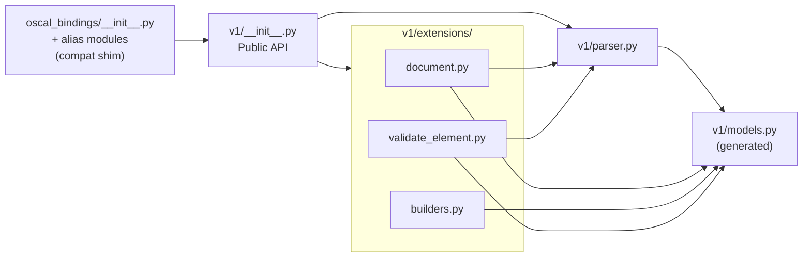

# Components

The library has five source components inside the version package `src/oscal_bindings/v1/` (plus the top-level compatibility shim, the code-generation script, and the test suite). Each maps to one file. All paths below are relative to `src/oscal_bindings/` unless noted.

## 1. `v1/models.py` — Generated models

**Responsibility:** Provide Pydantic v2 classes, enums, and type aliases for every OSCAL element across all 8 document types.

- **GENERATED — never hand-edit.** Regenerate with `hatch run generate`. (Not to be confused with the top-level `oscal_bindings/models.py`, which is a hand-written alias module.)
- Top of file carries the `datamodel-codegen` banner (filename + timestamp).
- Contains 8 document wrappers (`CatalogDocument`, `ProfileDocument`, `ComponentDefinitionDocument`, `SystemSecurityPlanDocument`, `AssessmentPlanDocument`, `AssessmentResultsDocument`, `PlanOfActionAndMilestonesDocument`, `MappingCollectionDocument`) plus the union root `OscalDocument`.
- Body models: `Catalog`, `Profile`, `SystemSecurityPlan`, `AssessmentPlan`, `AssessmentResults`, `PlanOfActionAndMilestones`, `ComponentDefinition`, `MappingCollection`, and hundreds of nested element models.
- Shared elements: `Metadata`, `BackMatter`, `Resource`, `Rlink`, `Hash`, `DocumentId`, `Link`, `Property`, `Role`, `Party`/`Parties`, `Parameter`, `Part`, etc.
- Enums: `Algorithm` (SHA-224 … SHA3-512), plus many small `Type`/`Scheme`/`Rel`/`State` enums.
- Models use `ConfigDict(extra='forbid')` and camelCase JSON aliases (e.g. `media-type`, `oscal-version`, `document-ids`).

## 2. `v1/parser.py` — Runtime parse/serialize/validate

**Responsibility:** Convert JSON ⇄ models and validate.

| Symbol | Kind | Purpose |
|--------|------|---------|
| `parse_oscal(data)` | function | `str \| bytes` → `OscalDocument` via `model_validate_json` |
| `parse_oscal_file(path)` | function | Reads file as **bytes**, delegates to `parse_oscal` |
| `serialize_oscal(model, *, indent=2)` | function | `model_dump_json(by_alias=True, exclude_none=True)` |
| `validate_oscal(data)` | function | Returns `bool`, swallows errors |
| `parse_catalog`, `parse_profile`, `parse_component_definition`, `parse_system_security_plan`, `parse_assessment_plan`, `parse_assessment_results`, `parse_plan_of_action_and_milestones`, `parse_mapping_collection` | functions | Typed parsers; each `hasattr`-checks `doc.root` for the expected body attr, else raises `OscalParseError` |
| `OscalParseError` | class | Raised on parse/validation failure; carries `.errors` (list of Pydantic error dicts) |

## 3. `v1/extensions/document.py` — `OscalDoc` facade

**Responsibility:** Uniform, type-agnostic access to any parsed OSCAL document.

- `OscalDoc` uses `__slots__ = ("_wrapper",)`; constructor accepts an `OscalWrapper` or an `OscalDocument` (unwraps `.root`), else raises `TypeError`.
- Classmethods `from_json(str|bytes)` and `from_file(path)`.
- Properties: `wrapper`, `body`, `metadata`, `oscal_version`, `uuid`.
- `assessment_period() -> (date|None, date|None)` — defined only for Assessment Plan (walks `tasks[].timing`, including nested subtasks: `on-date`, `within-date-range`; `at-frequency` contributes nothing) and Assessment Results (aggregates `results[].start`/`.end`). Earliest start / latest end win. Raises `OscalAccessError` on other types.
- Type unions `OscalBody` and `OscalWrapper` (each an 8-way union), and the module-private `_WRAPPER_TO_BODY_ATTR` dispatch map.
- `OscalAccessError` — raised when a typed accessor is used on the wrong document type.

## 4. `v1/extensions/builders.py` — back-matter builders

**Responsibility:** Ergonomic constructors for `back-matter` resource elements.

| Function | Notes |
|----------|-------|
| `make_hash(value, algorithm=Algorithm.SHA_256)` | Accepts enum or string (`"SHA-256"`); coerces string via `Algorithm(...)` |
| `make_rlink(href, *, media_type=None, hashes=None)` | Built via `Rlink.model_validate({...})` to satisfy the `media-type` alias |
| `make_resource(*, title, description, rlinks, uuid, document_ids)` | Generates a UUID4 when `uuid` omitted; `document_ids` set **post-construction** because the `document-ids` alias + `extra='forbid'` prevent passing it as a kwarg |

## 5. `v1/extensions/validate_element.py` — element-level validation

**Responsibility:** Validate an arbitrary OSCAL element fragment (a dict) against its model.

- `_pascal_to_kebab(name)` — converts model class names to kebab element types.
- `_build_element_map()` — introspects `oscal_bindings.v1.models` for all `BaseModel` subclasses, building `{kebab-name: model class}`; result cached in module-level `_ELEMENT_MAP`.
- `get_supported_element_types() -> list[str]` — sorted kebab names.
- `validate_element(element: dict|None, element_type: str) -> ElementValidationResult` — raises `OscalParseError` for unknown types; otherwise returns a result with `valid` and a list of `ValidationError(path, message)`.
- Dataclasses `ElementValidationResult` and `ValidationError` (re-exported as `ElementValidationError`).

## 6. `v1/__init__.py` — version package surface

**Responsibility:** Enumerate the public API for OSCAL major version 1, and record the exact schema release.

- Re-exports only; defines no symbols of its own beyond `__oscal_schema_version__`.
- `from .models import *`, then explicit named imports from `.parser` and `.extensions`.
- `__oscal_schema_version__ = "1.2.3"` — the full OSCAL release the vendored bundle (and therefore the models) came from. A literal by design; a test asserts it against the release element of the bundle's schema `$id`.
- `__all__` is the curated ~35-name surface (wrappers, parsers, facade, builders, validation, exceptions); the generated model names arrive via the star-import and are intentionally *not* in `__all__`.

## 7. Compatibility shim — `oscal_bindings/` top level

**Responsibility:** Keep every pre-`v1` import path resolving, to the identical objects. Four hand-written files, none of them generated:

| File | Behavior |
|------|----------|
| `__init__.py` | `from oscal_bindings.v1.models import *` (carries the generated names — bounded by `v1.__all__` if routed through `v1`, hence the direct import), `from oscal_bindings.v1 import *`, explicit re-export of `__oscal_schema_version__`, and `__all__ = list(v1.__all__)` so the surfaces cannot drift |
| `models.py` | `from oscal_bindings.v1.models import *` |
| `parser.py` | Re-exports `oscal_bindings.v1.parser` |
| `extensions/__init__.py` | Re-exports `oscal_bindings.v1.extensions`, with `__all__ = list(v1.extensions.__all__)` |

Explicit alias modules, not `sys.modules` aliasing — greppable, and `mypy`/`pdoc` handle them without special cases.

## 8. `scripts/postprocess_models.py` — codegen post-processor

**Responsibility:** Transform raw `datamodel-codegen` output into clean, named models. Run automatically after codegen by `hatch run generate`. Not part of the installed package. See `workflows.md` for the step sequence and `architecture.md` for the derivation and guards.

Notable symbols:

| Symbol | Purpose |
|--------|---------|
| `parse_args` / `main` | `--models` / `--schema` CLI, each with its own independent default (`DEFAULT_MODELS_PATH` = `src/oscal_bindings/v1/models.py`, `DEFAULT_SCHEMA_PATH` = `schemas/<ACTIVE_SCHEMA_RELEASE>/oscal_complete_schema.json`); exits non-zero naming any missing path |
| `ACTIVE_SCHEMA_RELEASE` | The active release string (`"1.2.3"`) — the only place the default bundle is selected |
| `iter_class_blocks` / `class_field_names` | Walk generated source, yielding `(class_name, body_lines)` in source order and the annotated field names per class |
| `derive_document_renames` | Content-based Document_Rename_Map; raises `AmbiguousWrapperError` on the first wrapper with >1 body field |
| `count_schema_document_types` | Length of the schema's top-level `oneOf`; `None` when absent (guard then has nothing to judge) |
| `report_wrapper_count_mismatch` | stderr report naming both the derived and expected counts |
| `find_duplicate_class_definitions` / `report_collisions` | Accumulate *all* duplicate class definitions after renaming and report the complete list; the file is not written |
| `collapse_scalar_root_models`, `fix_email_str_patterns`, `fix_non_string_patterns`, `rename_classes`, `rename_root_model`, `build_namespace_renames` | The transform phases |
| `PRESERVE_AS_ROOTMODEL`, `COLLISION_OVERRIDES`, `VARIANT_RENAMES` | Rename policy tables (the positional `DOCUMENT_RENAMES` dict is gone) |

## 9. `tests/` — test suite

| Module | Covers |
|--------|--------|
| `test_parser.py`, `test_document.py`, `test_builders.py`, `test_validate_element.py` | One per source component; test classes group scenarios (`TestAssessmentPeriod`, `TestMakeResource`, `TestTypedParsers`) |
| `test_oscal_bindings.py` | Import smoke test **and** back-compatibility: every pre-move public name imports from `oscal_bindings`, all three legacy module paths resolve, type identity holds across paths, and `__oscal_schema_version__` is semver-shaped and matches the bundle `$id` |
| `test_postprocess.py` | Post-processor units: content-based derivation against shuffled ordinals, the ambiguity/count/collision guards, CLI argument combinations, and a parity gate asserting the derivation reproduces the published eight names against the retained 1.2.2 bundle |
| `test_prop_postprocess.py` | Hypothesis property tests for the build-time derivation and guards (position-independence; collision accumulation) |
| `test_prop_version_package.py` | Properties 3–6: published-surface round trip, type identity across the shim, version-constant consistency, namespace stability |
| `support/version_package.py` | Pre-move `__all__` snapshot and schema `$id` helpers shared by the back-compat tests |
| `support/corpus.py` | Shared fixtures/corpus helpers |
