# Data Models

All data models live in the generated `src/oscal_bindings/v1/models.py` (Pydantic v2), generated from OSCAL release 1.2.3. This document describes their structure and the conventions that apply across them. **Do not hand-edit `v1/models.py`** — change the schema or the post-processor and regenerate. The top-level `oscal_bindings/models.py` is a hand-written alias module that re-exports the same class objects, so `oscal_bindings.Catalog is oscal_bindings.v1.models.Catalog`.

## Document Type Hierarchy

Every OSCAL JSON document has a single top-level key naming its type. That maps to a **wrapper** class holding one **body** field (plus the `$schema` directive field, which is what the post-processor uses to recognize a wrapper and derive its published name).

```mermaid
classDiagram
    class OscalDocument {
        <<union root>>
        +root: one of the 8 wrappers
    }
    class CatalogDocument {
        +catalog: Catalog
    }
    class ProfileDocument {
        +profile: Profile
    }
    class SystemSecurityPlanDocument {
        +system_security_plan: SystemSecurityPlan
    }
    class AssessmentPlanDocument {
        +assessment_plan: AssessmentPlan
    }
    class AssessmentResultsDocument {
        +assessment_results: AssessmentResults
    }
    class PlanOfActionAndMilestonesDocument {
        +plan_of_action_and_milestones: PlanOfActionAndMilestones
    }
    class ComponentDefinitionDocument {
        +component_definition: ComponentDefinition
    }
    class MappingCollectionDocument {
        +mapping_collection: MappingCollection
    }
    OscalDocument --> CatalogDocument
    OscalDocument --> ProfileDocument
    OscalDocument --> SystemSecurityPlanDocument
    OscalDocument --> AssessmentPlanDocument
    OscalDocument --> AssessmentResultsDocument
    OscalDocument --> PlanOfActionAndMilestonesDocument
    OscalDocument --> ComponentDefinitionDocument
    OscalDocument --> MappingCollectionDocument
```

`OscalDocument` is preserved as a Pydantic `RootModel` (in `PRESERVE_AS_ROOTMODEL`); its `.root` holds whichever wrapper matched. Typed parsers and `OscalDoc` hide the `.root` access.

## Wrapper → Body Mapping

`OscalDoc._WRAPPER_TO_BODY_ATTR` encodes the body field name for each wrapper:

| Wrapper | Body attribute | Body type |
|---------|----------------|-----------|
| `CatalogDocument` | `catalog` | `Catalog` |
| `ProfileDocument` | `profile` | `Profile` |
| `SystemSecurityPlanDocument` | `system_security_plan` | `SystemSecurityPlan` |
| `AssessmentPlanDocument` | `assessment_plan` | `AssessmentPlan` |
| `AssessmentResultsDocument` | `assessment_results` | `AssessmentResults` |
| `PlanOfActionAndMilestonesDocument` | `plan_of_action_and_milestones` | `PlanOfActionAndMilestones` |
| `ComponentDefinitionDocument` | `component_definition` | `ComponentDefinition` |
| `MappingCollectionDocument` | `mapping_collection` | `MappingCollection` |

Every body type carries a top-level `uuid` and a `metadata` block, which is what `OscalDoc.uuid` / `.metadata` / `.oscal_version` rely on.

## Shared Elements

These recur across document types:

- **`Metadata`** — title, version, `oscal-version`, roles, parties, responsible parties, revisions, links, props.
- **`BackMatter`** → **`Resource`** → **`Rlink`**, **`Hash`**, **`DocumentId`**, **`Citation`**, **`Base64`** — the back-matter resource tree targeted by the builder helpers.
- **`Property`**, **`Link`**, **`Part`**, **`Parameter`** — annotation/structuring primitives.
- **`Role`**, **`Party`/`Parties`**, **`Location`**, **`ResponsibleParty`**, **`ResponsibleRole`** — actors.
- **`Address`**, **`TelephoneNumber`**, **`Revision`** — sub-elements.

## Model Conventions

| Convention | Detail |
|------------|--------|
| Config | `ConfigDict(extra='forbid')` — unknown JSON keys are rejected |
| Field aliases | JSON uses kebab/camelCase (`media-type`, `oscal-version`, `document-ids`); Python attrs use snake_case; aliases bridge them |
| Populate-by-name | Not enabled — you must pass alias keys when using `model_validate({...})`, which is why `make_rlink` uses `"media-type"` |
| Constraints | `Annotated[T, Field(...)]` with `pattern`, `min_length`, etc. (produced by `--field-constraints`) |
| Scalars | Collapsed to `TypeAlias` (not `RootModel`) — e.g. a `uuid` field is a constrained `str`, accessed directly |
| Datetimes | `AwareDatetime`; `pattern=` constraints stripped by the post-processor since they're invalid on non-str types |
| Emails | `EmailStr`; redundant `pattern=` stripped |

## Name-Collision Handling

Five element short-names appear in more than one document namespace. The post-processor's `COLLISION_OVERRIDES` gives each a module-prefixed name so both survive. Any collision *not* covered there is a hard build failure: the post-processor scans the fully renamed source for duplicate class definitions, reports every one of them in a single report, and refuses to write the file.

| Schema key (namespace : short-name) | Python class |
|-------------------------------------|--------------|
| `...component-definition:control-implementation` | `ComponentDefinitionControlImplementation` |
| `...ssp:control-implementation` | `SspControlImplementation` |
| `...catalog:group` | `CatalogGroup` |
| `...profile:group` | `ProfileGroup` |
| `...component-definition:implemented-requirement` | `ComponentDefinitionImplementedRequirement` |
| `...ssp:implemented-requirement` | `SspImplementedRequirement` |
| `...control-common:select-control-by-id` | `ControlCommonSelectControlById` |
| `...assessment-common:select-control-by-id` | `AssessmentCommonSelectControlById` |
| `...component-definition:statement` | `ComponentDefinitionStatement` |
| `...ssp:statement` | `SspStatement` |

Other name variants that codegen numbers (`Merge1/2/3`, catalog `Group1/2`) are renamed to descriptive forms (`MergeFlat`, `MergeAsIs`, `MergeCustom`, `CatalogGroupWithGroups`, `CatalogGroupWithControls`) via `VARIANT_RENAMES`.

## Enums

Notable enum: **`Algorithm`** (`SHA-224`, `SHA-256`, `SHA-384`, `SHA-512`, `SHA3-224`, `SHA3-256`, `SHA3-384`, `SHA3-512`) — used by `make_hash`. Many small enums (`Type`, `Type1`, `Scheme`, `Scheme2`, `Rel`, `State`, `RiskStatus1`, …) constrain closed value sets; numbering suffixes come from codegen where the same short name recurs.

## Element Validation Model

`v1/extensions/validate_element.py` builds `_ELEMENT_MAP` by introspecting every `BaseModel` subclass in `v1/models.py` and converting its class name to kebab-case. So the set of validatable element types is derived directly from the generated model classes — see `get_supported_element_types()` for the live list (includes `catalog`, `metadata`, `observation`, `back-matter`, etc.).
