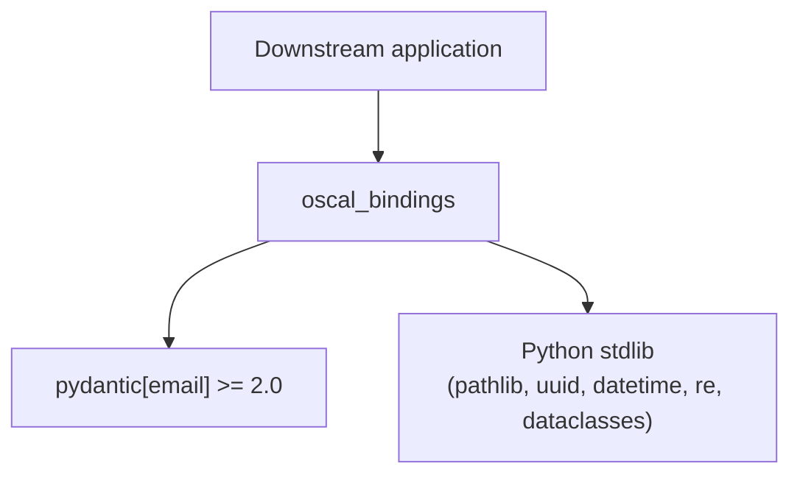

# Dependencies

## Runtime Dependencies

Declared in `pyproject.toml` `[project.dependencies]`.

| Dependency | Constraint | Why it's needed |
|------------|-----------|-----------------|
| `pydantic[email]` | `>=2.0` | The generated models are Pydantic v2 `BaseModel`s. The `email` extra provides `EmailStr` validation used by contact fields. Pydantic v2 is required — the codegen uses `--output-model-type pydantic_v2.BaseModel` and the runtime uses v2-only APIs (`model_validate_json`, `model_dump_json`, `RootModel`). |

That is the **only** runtime dependency. The library is otherwise pure standard library (`pathlib`, `uuid`, `datetime`, `re`, `dataclasses`, `enum`, `typing`).

## Optional / Codegen Dependency

Declared under `[project.optional-dependencies]` as the `codegen` extra:

| Dependency | Purpose |
|------------|---------|
| `datamodel-code-generator[http]` | Generates `src/oscal_bindings/v1/models.py` from the OSCAL JSON Schema. Dev/build-time only — **not** required to *use* the library, only to *regenerate* it. The `http` extra lets the generator resolve remote `$ref`s if needed. |

## Development Toolchain

Managed through Hatch environments (`[tool.hatch.envs.default.dependencies]`) rather than as project deps:

| Tool | Role |
|------|------|
| `pytest` | Test runner (`testpaths = ["tests"]`; coverage run under `hatch test --cover`) |
| `hypothesis` | Property-based tests (`tests/test_prop_*.py`); supplied via `extra-dependencies` on `[tool.hatch.envs.hatch-test]`, not a project dep |
| `mypy` | Static type checking (`hatch run typing`, over `src/oscal_bindings` including `v1`) |
| `datamodel-code-generator[http]` | Present in the default env for `hatch run generate` |
| `pdoc` | API documentation (`hatch run docs` → `build/api-docs`) |
| `ruff` | Linting and formatting; configured in `pyproject.toml` (`[tool.ruff]`, line length 88, `py311` target, first-party `oscal_bindings`) and pinned (`ruff==0.16.8`) in the default env; `hatch run lint` is the single entry point |

## Build / Environment Tooling

| Tool | Role |
|------|------|
| Hatch (`hatchling` backend) | Build backend + environment/script management. Wheel packages `src/oscal_bindings`; build output goes to `./build`. |
| `hatch-pip-compile` (`==1.11.8`) | Env type for `default`, `hatch-test`, `hatch-build`; writes hashed lockfiles `requirements.txt` and `requirements/requirements-hatch-{test.py3.11,test.py3.12,build}.txt`. `hatch-test` is constrained by `default`. |
| `uv` | Resolver and installer behind `hatch-pip-compile`. No `uv.lock`: the pip-compile lockfiles are the single lock system. `[tool.uv.workspace]` is still declared. |
| `mise` | Sole installer of the toolchain, locally and in CI (`jdx/mise-action`): Python 3.12, uv, and Hatch 1.18.1 with `hatch-pip-compile` injected, locked with hashes in `mise.lock` + `.mise/locks/`. |

## Python Version Support

- **Requires** Python `>=3.11` (`requires-python`).
- **Tested** on 3.11 and 3.12 (`[[tool.hatch.envs.hatch-test.matrix]]`, parallel).
- Codegen targets 3.11 syntax (`--target-python-version 3.11`), so generated models use `X | Y` unions and `list[...]` builtins.
- Default hatch env and `mise.toml` use 3.12.

## Schema Input (not a package dependency)

Schema bundles are vendored one directory per OSCAL release under `schemas/<release>/`, keeping the NIST filenames. `schemas/1.2.3/` is the Active_Schema_Bundle (1.2.2 is retained for reference only; no code or test reads it). Within a bundle, `oscal_complete_schema.json` is the single source fed to codegen; the per-type files (`oscal_catalog_schema.json`, etc.) are reference copies. These are checked-in input artifacts, not installed with the package — which is why `__oscal_schema_version__` is a literal on `oscal_bindings.v1` rather than parsed from the schema at import time.

The active bundle is selected by the explicitly passed path only (the `generate` script's `--input`/`--schema`, defaulting from `ACTIVE_SCHEMA_RELEASE` in `scripts/postprocess_models.py`) — no directory scan, no glob, no ordering dependence. Adding another `schemas/<release>/` directory changes nothing until that path changes.

## Dependency Risk Notes

- **Single tight runtime coupling to Pydantic v2.** A Pydantic 3.x major release could require regeneration and code changes in `v1/parser.py` / `v1/extensions/`. This is the main upgrade-watch item.
- **Codegen reproducibility** depends on the pinned `datamodel-code-generator` version *and* its transitive formatters (black, isort), all captured in the `requirements.txt` lockfile. Regenerating under the lock reproduces `v1/models.py` byte-for-byte. Regenerating with a different version may shift class names; the post-processor assumes the generator's `Model` root and `OscalComplete*` prefixing. Wrapper naming does not depend on the `Model1..8` ordinals (it is derived from each wrapper's body field), so a reordering or renumbering on the generator's side cannot silently mis-map names.
- **`extra='forbid'` ties coverage to the vendored release.** A document using a field added after the Active_Schema_Bundle release is rejected rather than ignored, so "supports OSCAL 1.x" means "supports 1.2.3 and earlier". `__oscal_schema_version__` is the introspection mechanism; a lenient mode is deferred, not rejected (see `DEVELOPING.md` Key Design Decisions).
- **No transitive runtime deps beyond Pydantic and its own deps**, keeping the install surface small for downstream compliance tooling.
