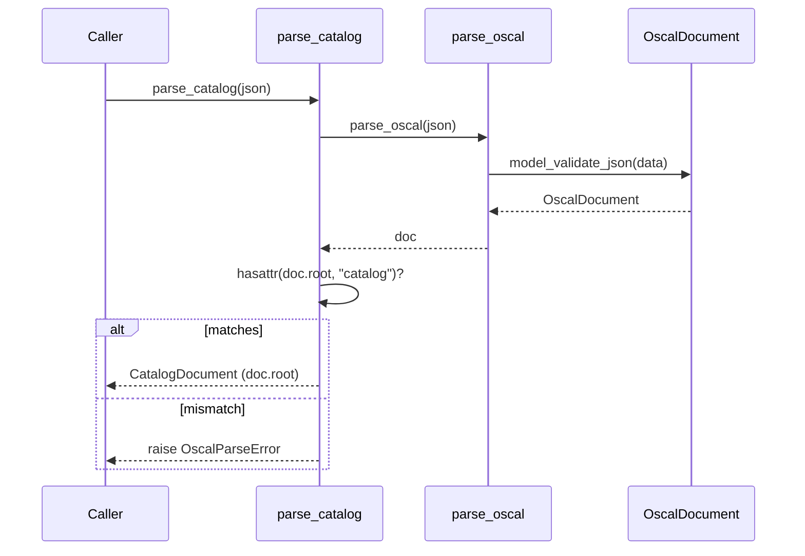
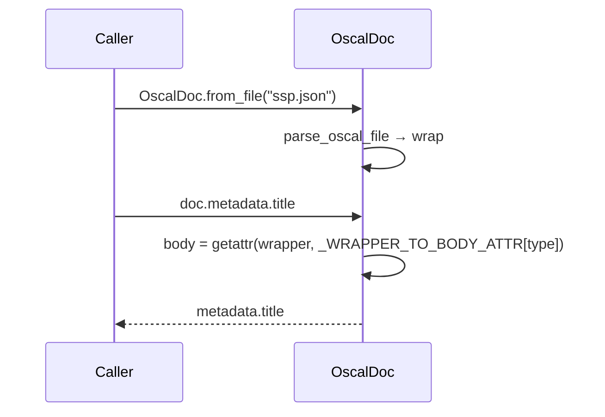

# Interfaces

The library is consumed as a Python import. Its "interface" is the set of public symbols re-exported from `oscal_bindings.v1` (the full list lives in `src/oscal_bindings/v1/__init__.py` `__all__`) plus the code-generation contract.

## Import Paths

```python
from oscal_bindings.v1 import parse_oscal_file, serialize_oscal   # preferred for new code
from oscal_bindings import parse_oscal_file, serialize_oscal      # equivalent
```

Both resolve to the **same objects** — the top level is a pure re-export, not a wrapper layer, so `isinstance` agrees regardless of which path a class came from. The top-level submodule paths `oscal_bindings.models`, `oscal_bindings.parser`, and `oscal_bindings.extensions` also resolve, via explicit alias modules.

```python
from oscal_bindings.v1 import __oscal_schema_version__   # "1.2.3" — also on the top level
```

## Public API Surface

All symbols are importable directly: `from oscal_bindings.v1 import <symbol>`. Callers never import from submodules.

### Parsing functions (`str | bytes` in)

```python
parse_oscal(data: str | bytes) -> OscalDocument
parse_oscal_file(path: Path | str) -> OscalDocument
```

Typed parsers (each returns the corresponding `*Document` wrapper, raising `OscalParseError` if the body type doesn't match):

```python
parse_catalog                        -> CatalogDocument
parse_profile                        -> ProfileDocument
parse_component_definition           -> ComponentDefinitionDocument
parse_system_security_plan           -> SystemSecurityPlanDocument
parse_assessment_plan                -> AssessmentPlanDocument
parse_assessment_results             -> AssessmentResultsDocument
parse_plan_of_action_and_milestones  -> PlanOfActionAndMilestonesDocument
parse_mapping_collection             -> MappingCollectionDocument
```

### Serialization & validation

```python
serialize_oscal(model, *, indent: int | None = 2) -> str   # pretty by default; indent=None → compact
validate_oscal(data: str | bytes) -> bool                  # never raises
```

### Facade

```python
OscalDoc(wrapper)                    # wraps OscalWrapper or OscalDocument
OscalDoc.from_json(data: str | bytes) -> OscalDoc
OscalDoc.from_file(path) -> OscalDoc
# properties: .wrapper .body .metadata .oscal_version .uuid
OscalDoc.assessment_period() -> tuple[date | None, date | None]   # AP/AR only
```

### Builders

```python
make_hash(value: str, algorithm: str | Algorithm = Algorithm.SHA_256) -> Hash
make_rlink(href: str, *, media_type: str | None = None, hashes: list[Hash] | None = None) -> Rlink
make_resource(*, title=None, description=None, rlinks=None, uuid=None, document_ids=None) -> Resource
```

### Element validation

```python
validate_element(element: dict | None, element_type: str) -> ElementValidationResult
get_supported_element_types() -> list[str]     # sorted kebab-case names
```

### Exported types & exceptions

- Document wrappers: `OscalDocument`, `CatalogDocument`, `ProfileDocument`, `ComponentDefinitionDocument`, `SystemSecurityPlanDocument`, `AssessmentPlanDocument`, `AssessmentResultsDocument`, `PlanOfActionAndMilestonesDocument`, `MappingCollectionDocument`
- Unions: `OscalBody`, `OscalWrapper`
- Result/support types: `ElementValidationResult`, `ElementValidationError`, `DocumentId`
- Exceptions: `OscalParseError` (has `.errors`), `OscalAccessError`
- Metadata: `__oscal_schema_version__` (a string, deliberately not in `__all__`)
- Plus everything from the generated models via `from oscal_bindings.v1.models import *`

## Interaction Sequences

Typed parse:



Facade access:



## Error-Handling Contract

| Situation | Behavior |
|-----------|----------|
| Invalid JSON / invalid UTF-8 bytes | `OscalParseError` (from `parse_oscal`) |
| Schema validation failure | `OscalParseError` with `.errors` = Pydantic error dicts |
| File missing | `FileNotFoundError` (from `parse_oscal_file`, includes path) |
| Typed parser, wrong document type | `OscalParseError("Document is not a …")` |
| `assessment_period()` on non-AP/AR | `OscalAccessError` |
| `OscalDoc(...)` with unrelated object | `TypeError` |
| `validate_element` unknown element type | `OscalParseError` |
| Builders with invalid input | `pydantic.ValidationError` |
| `validate_oscal` on invalid input | returns `False` (never raises) |

## Code-Generation Interface (build-time)

Not a runtime interface, but a contract between the schema and the models:

- **Input:** `schemas/1.2.3/oscal_complete_schema.json` (the Active_Schema_Bundle, selected by explicit path only)
- **Command:** `hatch run generate` → `datamodel-codegen --input <schema> --output <models> ... && python scripts/postprocess_models.py --schema <schema> --models <models>`
- **Output:** `src/oscal_bindings/v1/models.py` (overwritten)

The post-processor's own CLI contract:

```
postprocess_models.py [--models PATH] [--schema PATH]
```

Each argument has its own independent default, so a bare invocation and a one-argument invocation both work. A missing path exits non-zero naming the path. So do an ambiguous wrapper class, a wrapper-count mismatch against the schema's top-level `oneOf`, and any class-name collision not covered by `COLLISION_OVERRIDES` — in the collision case, all of them are reported at once.

Downstream code must not depend on raw generator names (`Model`, `Model1..8`, `OscalComplete*`); those are renamed by the post-processor. Wrapper names are derived from each class's body field rather than its ordinal. See `data_models.md` and `workflows.md`.
