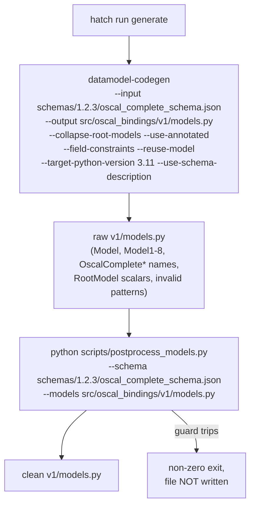
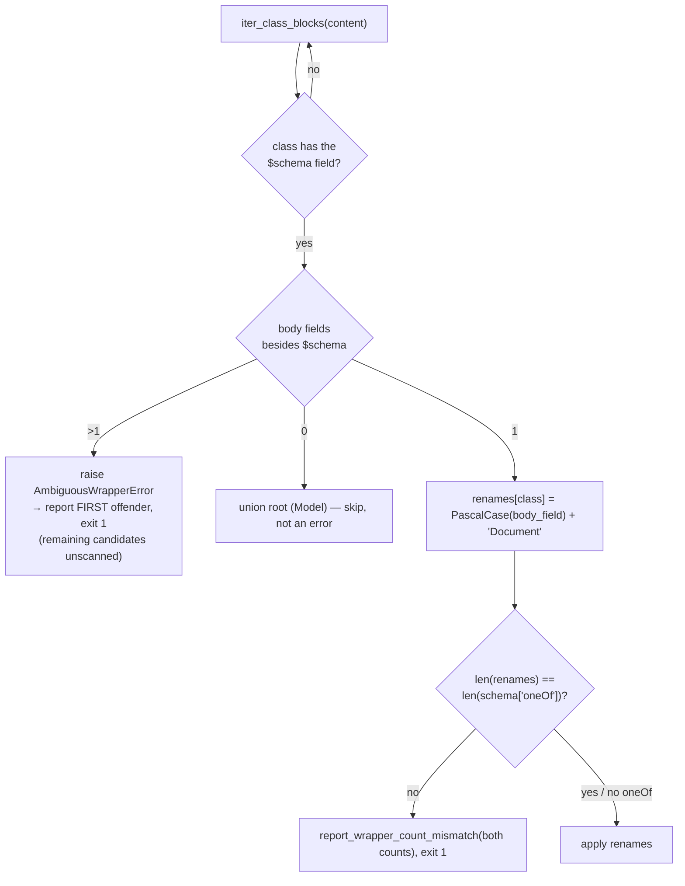
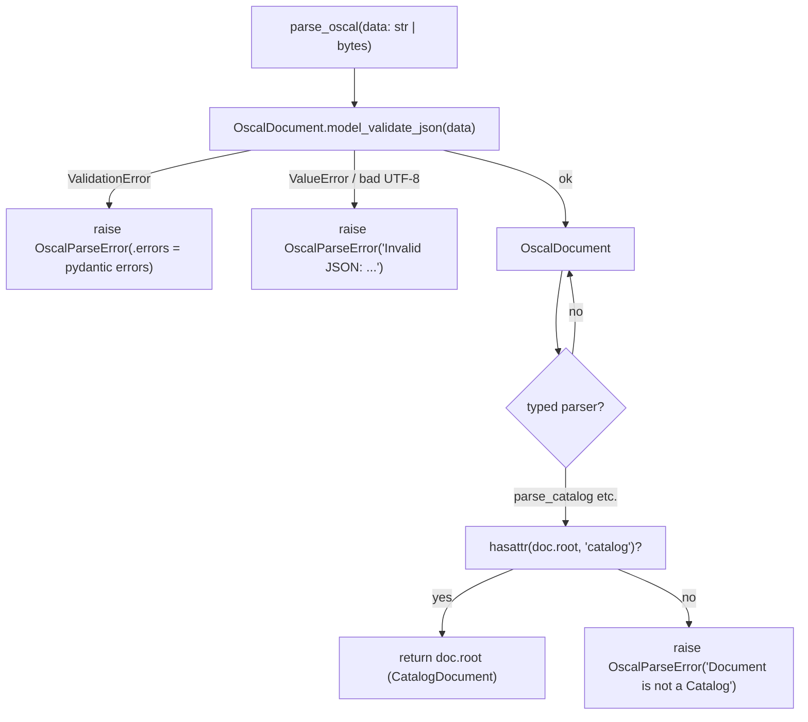
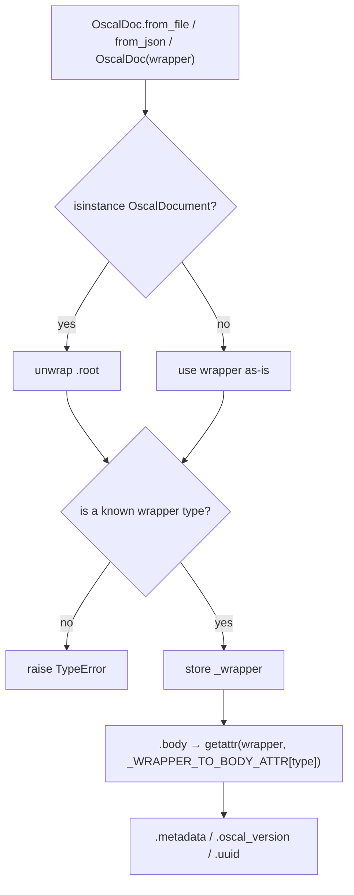
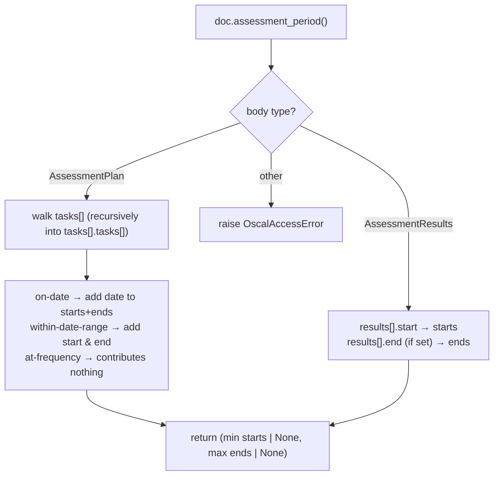
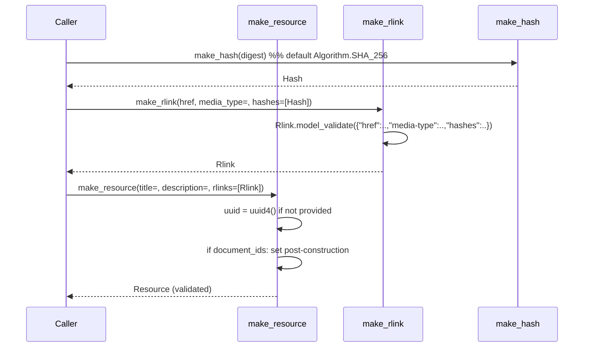
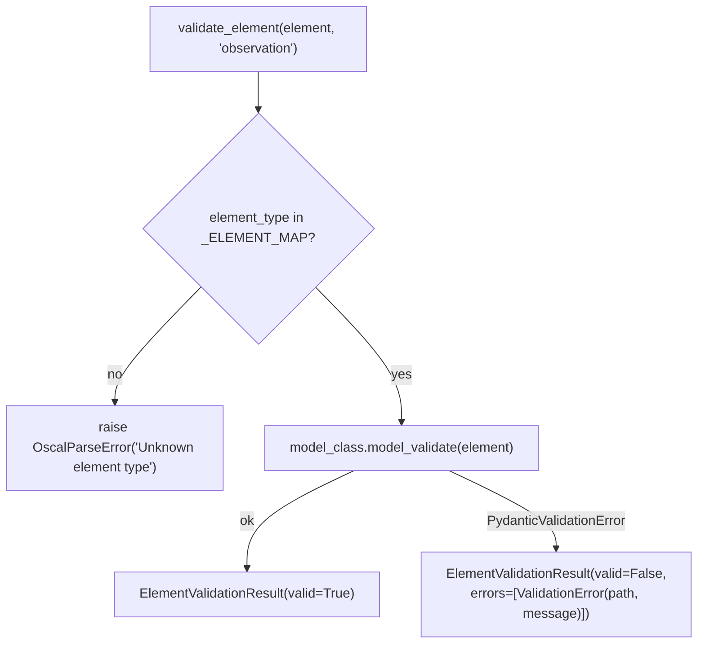
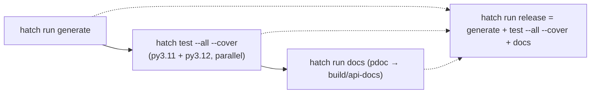

# Workflows

## 1. Code Generation (build-time)

Triggered by `hatch run generate`. This is the only supported way to change `v1/models.py`.

Both paths are passed explicitly. Each argument also carries its own independent default (`DEFAULT_MODELS_PATH`, `DEFAULT_SCHEMA_PATH` built from `ACTIVE_SCHEMA_RELEASE`), so a bare or one-argument invocation resolves correctly. A missing path exits non-zero naming it.

`postprocess_models.py` runs these phases in order (`main()`):

1. **`collapse_scalar_root_models`** — scalar `RootModel[...]` classes → `TypeAlias`; unions and `PRESERVE_AS_ROOTMODEL = {Model, Mappings}` kept as `RootModel`.
2. **`ensure_annotated_import`** — guarantees `Annotated` is imported.
3. **`fix_email_str_patterns`** / **`fix_non_string_patterns`** — strip `pattern=` constraints from `EmailStr`, `AwareDatetime`, `AnyUrl`, and numeric fields (regex patterns are invalid there).
4. **`derive_document_renames` + guards + `rename_classes`** — derive the wrapper rename map from the generated source's own content (see below), check it against the schema's document-type count, then apply it longest-key-first.
5. **`rename_root_model`** — standalone `Model` → `OscalDocument` (carefully avoiding `BaseModel`/`RootModel`/`ConfigDict`).
6. **`rename_classes(VARIANT_RENAMES)`** — merge/group numbered variants → descriptive names.
7. **`build_namespace_renames(schema_path)` + `rename_classes`** — strip `OscalComplete...` prefixes using schema definitions; apply `COLLISION_OVERRIDES`; handle numbered variants; sort by length desc to avoid partial replacements.
8. **Cleanup** — drop unused `RootModel` import; collapse 4+ blank lines.
9. **`find_duplicate_class_definitions` → `report_collisions`** — final gate: any name defined twice in the fully renamed source is an uncovered collision; report *all* of them and exit non-zero without writing.

Idempotent: re-running produces the same output for the same schema.

### 1a. Wrapper-name derivation and guards

Names track content, not position: reordering the schema's document types reorders the generated ordinals but not the derived names. Ambiguity fails **fast** (the scan's own premise is void); collisions **accumulate** (each is an independent finding a maintainer wants in one report).

## 1b. Refreshing to a new OSCAL release

Bundles are vendored one directory per release under `schemas/<release>/`, retaining the NIST filenames. `schemas/1.2.2/` and `schemas/1.2.3/` are both present; the *active* one is whichever path is passed — there is no glob and no "newest wins", so adding a bundle directory changes nothing on its own.

1. Add the new release's schema set under `schemas/<release>/`.
2. Point the Active_Schema_Bundle at it: the `--input`/`--schema` paths in the `generate` script, and `ACTIVE_SCHEMA_RELEASE` in `scripts/postprocess_models.py`.
3. Update `__oscal_schema_version__` in `src/oscal_bindings/v1/__init__.py` to the new release (a test asserts it against the bundle's schema `$id`).
4. Run `hatch run generate` and review the `v1/models.py` diff as schema-driven change only.
5. Add any newly surfaced collisions to `COLLISION_OVERRIDES` deliberately, guided by the collision report.
6. Run the suite. Within OSCAL 1.x the package name does **not** change — the refresh regenerates `v1` in place.

## 2. Parsing a Document (runtime)

`parse_oscal_file` reads the file as **bytes** (`read_bytes()`) and delegates to `parse_oscal`, so file parsing skips a decode step. A missing file raises `FileNotFoundError` before parsing.

## 3. Uniform Access via `OscalDoc`

### `assessment_period()` sub-workflow

## 4. Building back-matter resources

## 5. Element-level Validation

`_ELEMENT_MAP` is built once at import time by introspecting `oscal_bindings.v1.models`.

## 6. Developer / Release Workflow

From `DEVELOPING.md` and `pyproject.toml` hatch scripts:

- `hatch run typing` → mypy over `src/oscal_bindings` (which includes `v1`).
- `hatch run docs` → `pdoc oscal_bindings oscal_bindings.v1 -o build/api-docs` — both the top-level package and the version package are documented.
- Coverage `source_pkgs = ["oscal_bindings"]`, which reaches `v1` as a subpackage.
- The wheel packages `src/oscal_bindings`, so `v1` ships with it.
- Test artifacts: `htmlcov/` (HTML coverage, git-ignored), written only under `--cover`.
- Lockfiles (`requirements.txt`, `requirements/*.txt`) are regenerated by `hatch-pip-compile` whenever an env's declared deps change; deliberate upgrades use `PIP_COMPILE_UPGRADE=1` (see DEVELOPING.md "Locked Environments").

### Adding an extension (from `DEVELOPING.md`)
1. Add `v1/extensions/foo.py`.
2. Re-export public symbols from `v1/extensions/__init__.py`.
3. Re-export from `src/oscal_bindings/v1/__init__.py`.
4. Add tests under `tests/`.

Nothing to do at the top level: the top-level `__all__` is derived from `v1.__all__`, so a new name appears on the top-level path automatically. Neither `__init__.py` ever defines new symbols.
