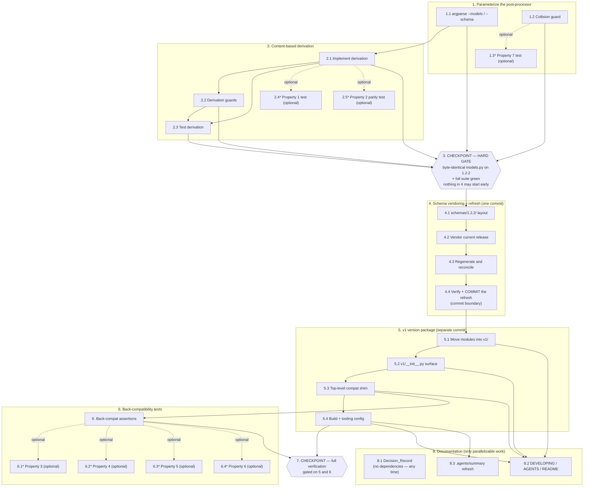

# Implementation Plan: Major-Version Namespace

## Overview

Move the public API into `oscal_bindings.v1`, parameterize codegen on schema/output paths, and replace the positional wrapper-rename map with content-based derivation.

Task order is dictated by a review constraint from the design: the derivation fix lands first (so it is exercised by a real schema change), then the schema refresh, then the package move. Refresh and move must be separate commits — combined, the `models.py` diff mixes schema content changes with import path changes and neither is reviewable.

Out of scope throughout: a `v2` package, any dispatch registry, and changes to `extra='forbid'`.

## Tasks

- [x] 1. Parameterize the post-processor
  - [x] 1.1 Convert path constants to CLI arguments
    - Replace module-level `MODELS_PATH` / `SCHEMA_PATH` in `scripts/postprocess_models.py` with argparse `--models` / `--schema`
    - Give each argument its own `default=` (Active_Schema_Bundle schema path; Version_Package models path) so the two resolve **independently** — omitting `--schema` falls back to its default whether or not `--models` was supplied, and vice versa. Do **not** write a coupled `if not args.schema and not args.models:` fallback block; plain argparse defaults are the mechanism
    - A bare invocation stays unchanged, and supplying exactly one of the two arguments works
    - Exit non-zero with the offending path when either file is missing
    - Thread the schema path through `build_namespace_renames()`, which currently reads the module-level `SCHEMA_PATH` directly
    - Cover all four argument combinations with tests — both args, `--schema` only, `--models` only, neither — asserting each omitted argument resolves to its own default regardless of the other
    - _Requirements: 2.1, 2.2, 2.3, 2.4_

  - [x] 1.2 Add a collision guard
    - After all rename phases, detect duplicate `class <Name>(` definitions in the output; do **not** stop at the first one
    - Complete processing of all Wrapper_Classes, accumulate every collision not covered by `COLLISION_OVERRIDES`, then exit non-zero reporting the complete accumulated list in a single report, rather than writing a file with colliding definitions
    - _Requirements: 7.3_

  - [x] 1.3 Write property test for the collision guard
    - New module `tests/test_prop_postprocess.py`; tag `Feature: major-version-namespace, Property 7: For any generated source introducing k uncovered class-name collisions, the Post_Processor exits non-zero and its single report names all k of them`; `max_examples>=100`
    - **Genuinely generative** — `@given` a count `k` (and the colliding names) and synthesize a generated-source fixture that forces exactly `k` uncovered collisions; assert non-zero exit and that all `k` names appear in the one report
    - _Requirements: 7.3_
    - _Properties: 7_

- [x] 2. Replace positional wrapper renaming with content-based derivation
  - [x] 2.1 Implement the derivation
    - Add a function that scans generated source for wrapper classes and, for each, extracts its single body field name excluding the `$schema` directive field (`field_schema`)
    - Map each root key to `<PascalCase>Document` (`catalog` → `CatalogDocument`, `system_security_plan` → `SystemSecurityPlanDocument`)
    - Delete the hardcoded positional `DOCUMENT_RENAMES` dict
    - _Requirements: 3.1, 3.2, 3.3, 3.4_

  - [x] 2.2 Add the derivation guards
    - Ambiguous wrapper (more than one body field besides `field_schema`) → **fail fast**: report that first offending class and exit non-zero immediately, leaving the remaining candidate Wrapper_Classes unscanned. Do not collect further offenders
    - Derived wrapper count ≠ document-type count in the schema's top-level `oneOf` → exit non-zero reporting both counts
    - _Requirements: 3.5, 3.6_

  - [x] 2.3 Test the derivation
    - Unit-test against a synthetic generated-source fixture with deliberately shuffled ordinals; assert names track content not position
    - **Fail-fast ambiguity test:** fixture containing *two* ambiguous wrappers; assert non-zero exit, that the message names the **first** offender, and that the second offender is **absent** from the report — proving the scan stopped rather than continuing
    - Test the count-mismatch guard fires with both counts in the message
    - **Collision accumulation test:** fixture introducing several uncovered collisions; assert non-zero exit and that *every* collision appears in the single report from one run
    - **Parity gate:** run against the current 1.2.2 bundle and assert the derived map produces exactly the eight names the positional map produced
    - _Requirements: 3.5, 3.6, 3.7, 7.3_

  - [x] 2.4 Write property test for position-independent derivation
    - In `tests/test_prop_postprocess.py`; tag `Feature: major-version-namespace, Property 1: For any generated model source containing a set of Wrapper_Classes, permuting the ordinal suffixes of those class names leaves the derived Document_Rename_Map's set of published names unchanged`; `max_examples>=100`
    - **Genuinely generative** — `@given` a permutation of the wrapper ordinals (e.g. `st.permutations`) applied to a synthetic generated-source fixture; assert the derived set of published names is invariant under the permutation
    - _Requirements: 3.4_
    - _Properties: 1_

  - [x] 2.5 Write parity test for the derived map
    - In `tests/test_prop_postprocess.py`; tag `Feature: major-version-namespace, Property 2: For all eight Wrapper_Classes in the Active_Schema_Bundle output, the derived published name equals the name the positional DOCUMENT_RENAMES map produced`
    - **Example-based, not `@given`** — the input is the single real Active_Schema_Bundle output, so this is a fixed-point assertion against the snapshotted eight-name positional map. Do not force a Hypothesis strategy onto it
    - _Requirements: 3.7_
    - _Properties: 2_

- [x] 3. Checkpoint — derivation is correct before it touches a real refresh
  - Run `hatch run generate` against the unchanged 1.2.2 schema and confirm `models.py` is byte-identical to the pre-change committed version
  - A non-empty diff here means the derivation changed something it should not have; stop and investigate rather than accepting the new output
  - Confirm the full existing suite passes on the default Python
  - _Requirements: 3.7_

- [x] 4. Restructure schema vendoring and refresh to the current release
  - [x] 4.1 Move schemas into a release-versioned directory
    - Create `schemas/1.2.2/` and move the existing eight schema files into it unchanged
    - Update the `generate` script's `--input` path and the post-processor default
    - Select the Active_Schema_Bundle **by the explicitly passed path only** — no directory scan, no glob, no "newest release wins" ordering, and no dependence on how many bundle directories exist. Adding a second `schemas/<release>/` directory alongside the first must change nothing until the passed path changes
    - _Requirements: 1.1, 1.2, 1.3, 1.4_

  - [x] 4.2 Vendor the current OSCAL release
    - Confirm the latest OSCAL 1.x release at implementation time (1.2.3 as of this writing; re-check before starting)
    - Add its schema set under `schemas/<release>/` and point the Active_Schema_Bundle at it
    - _Requirements: 7.1_

  - [x] 4.3 Regenerate and reconcile
    - Run `hatch run generate`; review the `models.py` diff as schema-driven change only
    - Add any newly surfaced collisions to `COLLISION_OVERRIDES` deliberately, guided by the 1.2 guard from task 1.2
    - Confirm all eight wrapper names survive
    - _Requirements: 7.2, 7.3_

  - [x] 4.4 Verify and commit the refresh on its own
    - Full existing suite green before the package move begins
    - _Requirements: 7.2_

- [x] 5. Create the `v1` version package
  - [x] 5.1 Move the generated and hand-written modules
    - Move `models.py`, `parser.py`, and `extensions/` into `src/oscal_bindings/v1/`
    - Rewrite intra-package imports from `oscal_bindings.*` to `oscal_bindings.v1.*` across `parser.py`, `extensions/document.py`, `extensions/validate_element.py`, and `extensions/__init__.py`
    - Update the `generate` script's `--output` and the post-processor's models default to the new path
    - _Requirements: 4.1, 4.2, 4.3_

  - [x] 5.2 Build the Version_Package surface
    - Add `v1/__init__.py` re-exporting the full pre-move public surface, defining no symbols of its own
    - Add `__oscal_schema_version__` set to the Active_Schema_Bundle release, matching the release in the schema `$id`
    - _Requirements: 4.4, 6.1, 6.2, 6.3_

  - [x] 5.3 Reduce the top level to a compatibility shim
    - Rewrite `src/oscal_bindings/__init__.py` as pure re-exports from `oscal_bindings.v1`, preserving the `from ...models import *` behavior that makes generated model names top-level importable, and re-exporting `__oscal_schema_version__`
    - Add explicit alias modules at `oscal_bindings/models.py`, `oscal_bindings/parser.py`, and `oscal_bindings/extensions/__init__.py` re-exporting from their `v1` counterparts (explicit modules, not `sys.modules` aliasing)
    - _Requirements: 5.1, 5.2, 5.3, 5.4, 5.5, 5.6, 6.4_

  - [x] 5.4 Update build and tooling configuration
    - Confirm the wheel packages `v1` (the existing `packages = ["src/oscal_bindings"]` should cover it — verify, do not assume)
    - Confirm the `typing`, `docs`, and coverage `source_pkgs` targets reach the Version_Package
    - _Requirements: 4.5, 9.3, 9.4, 9.5_

- [x] 6. Add back-compatibility tests
  - Extend `tests/test_oscal_bindings.py`: import every pre-move public name from `oscal_bindings`; import all three legacy module paths
  - Assert type identity across paths (`oscal_bindings.Catalog is oscal_bindings.v1.models.Catalog`)
  - Assert the Version_Package surface matches the snapshotted pre-move `__all__`
  - Assert `__oscal_schema_version__` is semver-shaped and equals the release parsed from the schema `$id`
  - _Requirements: 4.4, 5.1, 5.5, 5.6, 6.1, 6.2, 6.3, 9.2_

  - [x] 6.1 Write published-surface round-trip property test
    - New module `tests/test_prop_version_package.py`; tag `Feature: major-version-namespace, Property 3: For all names in the pre-move top-level __all__, that name appears in the Version_Package __all__, and the two sets are equal in both directions`
    - **Example-based, not `@given`** — the committed pre-move `__all__` snapshot is a fixed input; assert set equality in both directions (no name added, none dropped)
    - _Requirements: 4.4_
    - _Properties: 3_

  - [x] 6.2 Write type-identity property test across the Compat_Shim
    - In `tests/test_prop_version_package.py`; tag `Feature: major-version-namespace, Property 4: For any name in the Public_Surface, the object reached through the Compat_Shim is the same object as the one reached directly through the Version_Package`
    - **Enumerable, so parametrize — do not generate.** `@pytest.mark.parametrize` over the Public_Surface (`oscal_bindings.__all__`) and assert `getattr(oscal_bindings, name) is getattr(oscal_bindings.v1, name)` for every entry; exhaustive enumeration is strictly stronger than sampling here
    - _Requirements: 5.3, 5.6_
    - _Properties: 4_

  - [x] 6.3 Write version-constant consistency property test
    - In `tests/test_prop_version_package.py`; tag `Feature: major-version-namespace, Property 5: For any Active_Schema_Bundle, the Schema_Version_Constant equals the release version parsed out of that bundle's schema $id`
    - **Example-based, not `@given`** — parse the release element out of the real Active_Schema_Bundle `$id` at test time and assert equality with `__oscal_schema_version__`; also assert the constant is semver-shaped (major.minor.patch)
    - _Requirements: 6.3_
    - _Properties: 5_

  - [x] 6.4 Write namespace-stability property test
    - In `tests/test_prop_version_package.py`; tag `Feature: major-version-namespace, Property 6: For any Active_Schema_Bundle within OSCAL 1.x, the Version_Package name is unchanged — it carries a major component only`
    - **Example-based, not `@given`** — assert the Version_Package name equals `"v" + major(__oscal_schema_version__)` and that it carries no minor or patch component, so no 1.x minor/patch bump can perturb it
    - _Requirements: 4.6_
    - _Properties: 6_

- [x] 7. Checkpoint — full verification
  - `hatch test --all` green on 3.11 and 3.12
  - Confirm the generative property tests (Properties 1 and 7) execute at >=100 examples each and that Hypothesis counterexamples surface in pytest output when they fail
  - `hatch run typing` clean
  - `hatch run docs` produces documentation covering the Version_Package
  - Confirm no runtime dependency changed and `extra='forbid'` is untouched
  - Ensure all tests pass, ask the user if questions arise.
  - _Requirements: 9.1, 9.3, 9.5, 10.3, 10.4_

- [x] 8. Update documentation and the decision record
  - [x] 8.1 Rewrite the Decision_Record *(done in the backlog at the time; the record now lives in `DEVELOPING.md` Key Design Decisions)*
    - Restate from "declined" to accepted-at-major-granularity: namespaces are major-scoped; minor-version namespacing considered and rejected on compatibility-boundary grounds; OSCAL 2.0 is the trigger for a second Version_Package
    - Record that `extra='forbid'` makes major-version coverage contingent on tracking the current release, with `__oscal_schema_version__` as the introspection mechanism, and note the lenient-mode option as deferred rather than rejected outright
    - _Requirements: 8.1, 8.2, 8.3, 8.4_

  - [x] 8.2 Update the three doc surfaces
    - `DEVELOPING.md`: replace the "Single-version bindings" decision bullet; document the schema refresh procedure against the release-versioned layout
    - `AGENTS.md`: replace the "Single-version bindings" gotcha and the `models.py` path references; note that the wrapper rename map is now schema-derived
    - `README.md`: document the `v1` import path, note the flat paths remain supported, and mention `__oscal_schema_version__`
    - _Requirements: 8.5, 8.6_

  - [x] 8.3 Refresh the `.agents/summary/` knowledge base
    - Update the stale single-version claims in `codebase_info.md`, `index.md`, and `architecture.md`, and the layout maps affected by the move
    - _Requirements: 8.5_

## Notes

- Sub-tasks marked with `*` are test tasks and can be skipped for a faster path; the core implementation tasks are never optional.
- Property tests follow the existing repo convention from the `property-based-tests` spec: modules named `tests/test_prop_<family>.py`, each test annotated `Feature: major-version-namespace, Property {number}: {property_text}`, and generative tests configured for at least 100 examples via the `ci` Hypothesis profile. `hypothesis` is already available through `extra-dependencies` on `[tool.hatch.envs.hatch-test]` — no dependency work is needed.
- Two property modules: `tests/test_prop_postprocess.py` (Properties 1, 2, 7 — build-time derivation and guards) and `tests/test_prop_version_package.py` (Properties 3, 4, 5, 6 — published surface, identity, version constant, namespace).
- Only Properties 1 and 7 are genuinely generative and use `@given`. Property 4 is enumerable over the Public_Surface and is parametrized. Properties 2, 3, 5 and 6 are fixed-input assertions against the real Active_Schema_Bundle and the committed surface snapshot, so they are example-based — do not force `@given` onto them.
- `_Properties: N_` annotations sit alongside `_Requirements: ..._` so property-to-requirement traceability is visible in the task list.
- The refresh (task 4) and the package move (task 5) must land as separate commits, refresh first — see the Overview.

## Task Dependency Graph

```json
{
  "waves": [
    { "id": 0, "tasks": ["1.1", "1.2", "8.1"] },
    { "id": 1, "tasks": ["1.3", "2.1"] },
    { "id": 2, "tasks": ["2.2"] },
    { "id": 3, "tasks": ["2.3", "2.4", "2.5"] },
    { "id": 4, "tasks": ["3"] },
    { "id": 5, "tasks": ["4.1"] },
    { "id": 6, "tasks": ["4.2"] },
    { "id": 7, "tasks": ["4.3"] },
    { "id": 8, "tasks": ["4.4"] },
    { "id": 9, "tasks": ["5.1"] },
    { "id": 10, "tasks": ["5.2"] },
    { "id": 11, "tasks": ["5.3"] },
    { "id": 12, "tasks": ["5.4", "6"] },
    { "id": 13, "tasks": ["6.1", "6.2", "6.3", "6.4", "8.2", "8.3"] },
    { "id": 14, "tasks": ["7"] }
  ]
}
```



The near-linearity of this graph is intentional, not an artifact of under-analysis: the refresh (task 4) and the package move (task 5) must land as separate commits with the refresh first — see the Overview — so 4.4 is a real commit boundary that 5.1 cannot cross, and checkpoint 3 is a hard gate rather than a wave boundary that can be slipped. The only genuinely parallelizable work is task 8.1, which can be written at any point; 8.2 and 8.3 wait on the final layout from task 5. Optional `*` sub-tasks (1.3, 2.4, 2.5, 6.1–6.4) sit adjacent to their parent implementation tasks and are skippable without blocking anything downstream.
